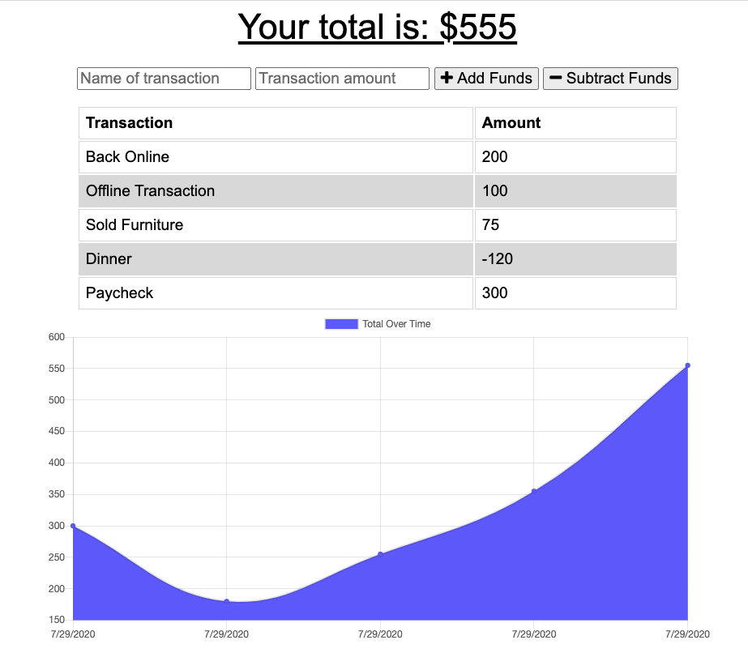

# Budget Tracker PWA

This full stack PWA allows a user to enter budget transactions on and offline.  The transactions that are made offline, will sync to the database once the user comes back online.

This app utilizes a service-worker and manifest as well as indexedDB.

## Application Visual

## Where To Find This App

[GitHub Repository](https://github.com/karenastell/budget)

[Heroku](https://serene-anchorage-25364.herokuapp.com/)